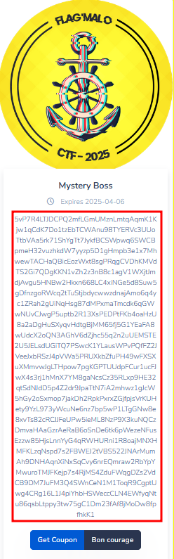
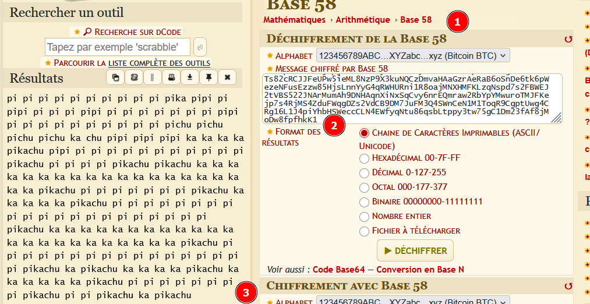

# Flag'Malo 2025

## Is-that-a-clue (Adaptation challenge Orange)

> ### Cryptographie - Facile

---

### Solution

*Pour pouvoir tester de ton côté (le QR code étant désactivé), tu peux regarder le fichier [Chaines.md](./Chaines.md)*

#### 1 - Scanne le QRCode et récupères la chaine encodée (encadrée en rouge dans la capture)

---

#### 2 - Tu vas sur DCode et tu décodes la chaine encodée en Base58 pour obtenir celle encodée en pikalang

- 1 : Trouver la partie codage/décodage base58 sur le site
- 2 : Mettre la chaine de la zone "à déchiffrer"
- 3 : Appuyer sur le bouton déchiffrer et récupérer la chaine décodée

---

#### 3 - Tu vas sur DCode et tu décodes la chaine encodée en pikalang pour obtenir celle en ascii

- 1 : Trouver la partie codage/décodage pikalang sur le site
- 2 : Mettre la chaine de la zone "à déchiffrer"
- 3 : Appuyer sur le bouton déchiffrer et récupérer la chaine décodée

---

#### Réponse attendue : 

`FMCTF{Boss_fav_pokemon}`

