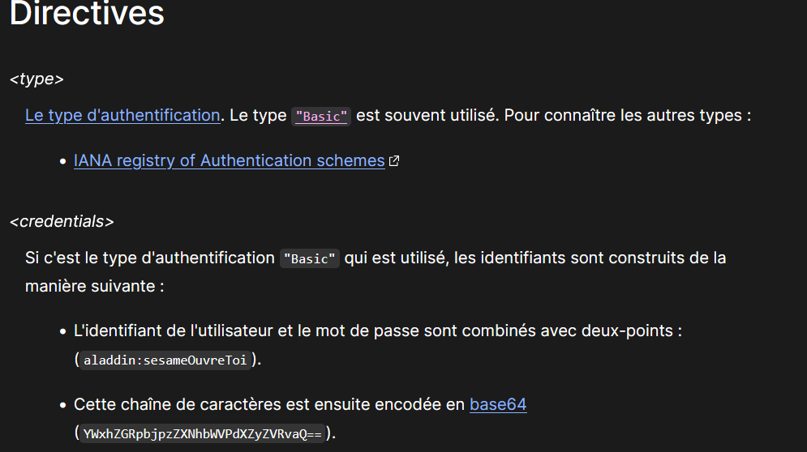
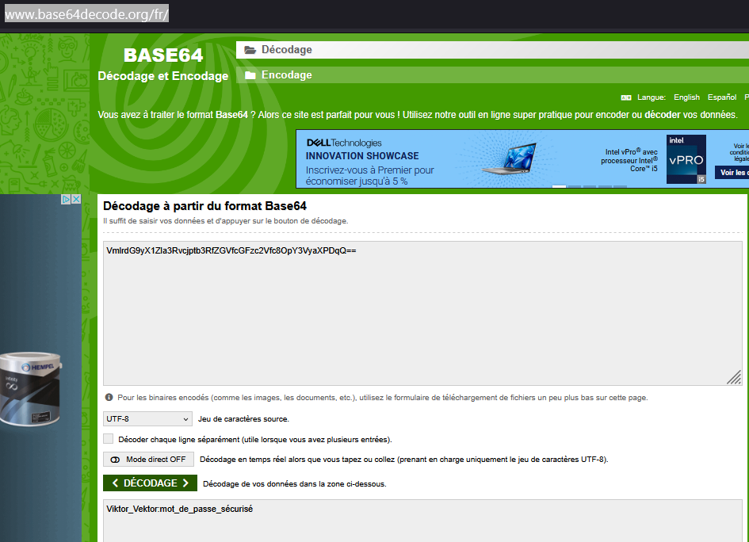

# Flag'Malo 2025

## Qui-est-ce

> ### Cryptographie - Intro

---

### Solution

#### 1 - Que faire de la chaine donnée dans l'énoncé

La Chaine de caractère à analyser est : Y3J5cHRleF9kZWx0YV9taXJhZ2VfVjptZHBfc2VjdXJlZA==

En faisant une recherche sur l'énoncé, par exemple en tapant : "l'entête "Authorization" issu de sa requête web", on arrive assez facilement sur la page: [Authorization-Info](https://developer.mozilla.org/fr/docs/Web/HTTP/Reference/Headers/Authorization)

**En parcourant la page web, on tombe sur cette section :**

L'information importante dans cette section est que l'information est encodée en **base 64** et que le format de l'authentification est **user:motdepasse**

---

#### 2 - Décoder la chaine avec les informations obtenues

Soit on connaît le fonctionnement des authentifications http (Basic) et donc vous savez que le codage utilisé est le code 64, repérable aussi avec le double "==" à la fin de la chaîne.

Il ne reste donc plus qu'à trouver un décodeur en base 64, en cherchant : "décodeur base64".
On arrive souvent sur ce site web : https://www.base64decode.org/fr/

Le site ressemble à ça, vous pouvez voir le résultat (cryptex_delta_mirage_V:mot_de_passe_sécurisé) :

---

Réponse attendue : **FMCTF{cryptex_delta_mirage_V}**

