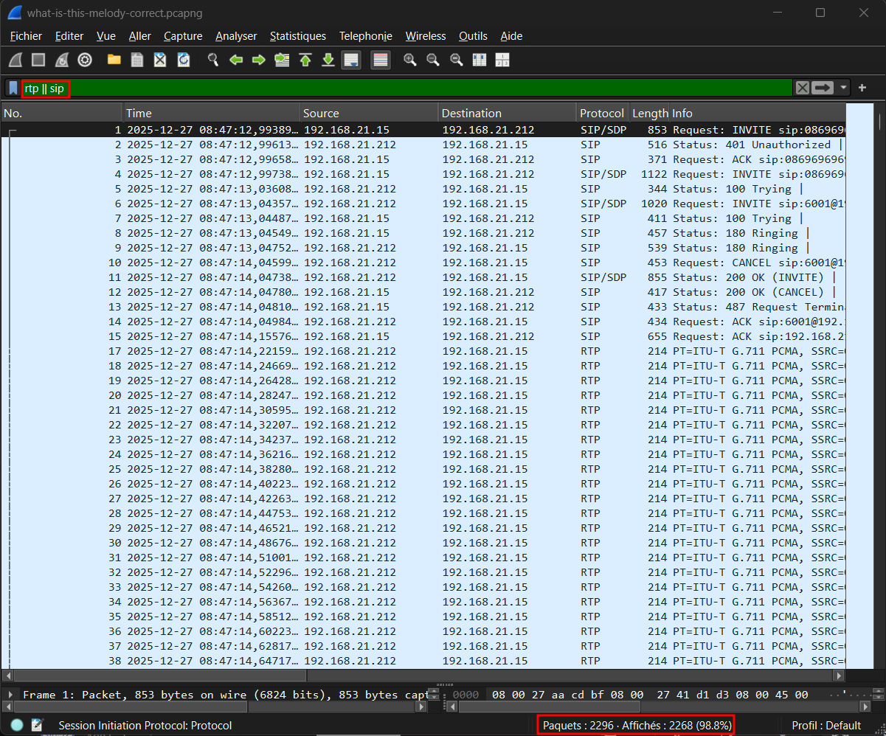
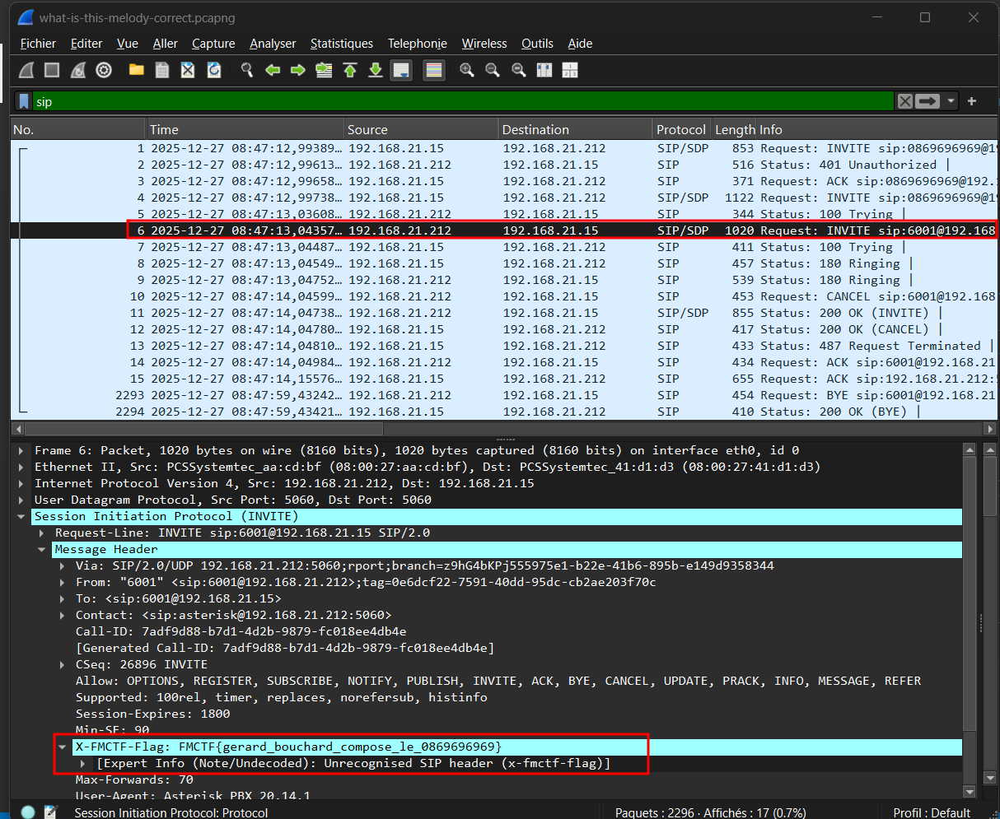

# Flag'Malo 2025

## Strange-Conversation

> ### Misc - Moyen

---

### Solution

#### 1 - Trouver le numéro

L'extension attribuée à ce chall n'est pas donnée explicitement dans la consigne. L'indice donné dans la description est : 
- `Appelle le numéro que compose un certain "Gérard Bouchard"`. En faisant une recherche rapide, on tombe facilement sur cette [vidéo](https://www.youtube.com/watch?v=jlZQHrYHvAY) ou [celle-là](https://www.youtube.com/watch?v=ejhxxf242mw). En regardant les 30 premières secondes, on comprend qu'il faut composer le numéro suivant : `0869696969`

---

#### 2 - Appeler le numéro et trouver la bonne piste

Tu vas entendre un extrait de musique avec notamment la phrase "What is this melody" (nom du chall) provenant d'un extrait de la musique de la vidéo suivante : [Musique-n°1]() (entre 00:27 et 00:32). Le reste de la musique correspond à une musique libre de droit : [Musique-n°2]().
De là, rien n'est définitif ni clair. Le flag n'est pas donné en clair dans la musique et il n'y a pas d'énigmes comme les challenges précédents. Il pourrait y avoir quelque chose de cacher dans l'audio, devoir trouver qui a composé une des musiques, ... La consigne est floue et c'est le résultat attendu de celle-ci.
La bonne piste à suivre est d'ouvrir `Wireshark` et d'ouvrir grand les yeux.

---

#### 3 - Recherche d'informations sur Wireshark

Sur `Wireshark`, vous allez facilement voir des milliers voire des dizaines de milliers de paquets. La première étape va donc être de réduire le champs de recherche. En téléphonie, il y a uniquement quelques protocoles qui sont utiles/utilisés. On va donc filtrer pour ne garder que ceux là. Par exemple :

Le problème, c'est qu'il y a toujour un grand nombre de paquets avec une écrasante majorité de fichiers `RTP`. Heureusement, je n'ai pas trouvé (ni chercher assez longtemps) pour mettre un flag dans les flux `RTP`. Il ne nous reste plus que les flux `SIP`.
Si vous avez bien observé ou si vous regardez votre historique d'appel, vous allez vous apercevoir que vous recevez à chaque fois un appel bref du `0869696969` quand vous l'appelez.
Ce n'est pas sans raison, c'est comme ça que j'ai pu mettre un flag dans les flux `SIP`, j'appelle la source de l'appel brièvement en rajoutant un header personnalisé. En trouvant le paquet `SIP INVITE` correspondant à cet appel et en vous dirigeant dans la partie `HEADERS` du paquet, vous allez tomber sur le flag comme ci-dessous : 

---

#### Réponse attendue : 

`FMCTF{gerard_bouchard_compose_le_0869696969}`

