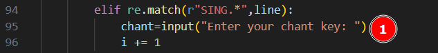
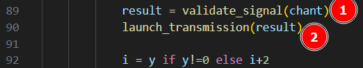
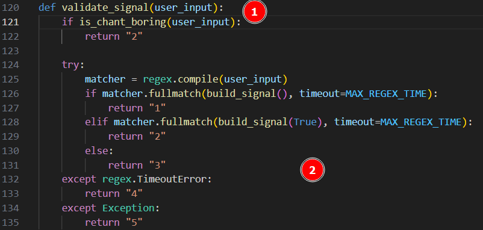
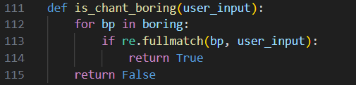
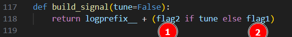
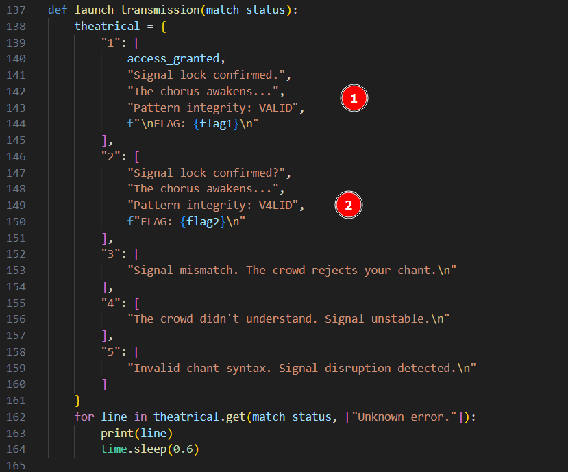
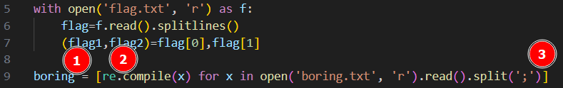

# Flag'Malo 2025

## Glitched_Hymn_of_the_Neon_Dawn

> ### Prog - Facile

---

### Solution

#### 1 - Lis le code et trouve quel endroit pourrait être sensible à une action que tu pourrais faire

Ici, on trouve un endroit dans le code où on intéragit (input -> attend une entrée utilisateur)

---

#### 2 - Trouver à quel moment l'entrée utilisateur est utilisée dans le code

On voit qu'il y a 2 fonctions qui utilisent cette entrée utilisateur :
- Directement : validate_signal
- Indirectement : launch_transmission

---

#### 3 - Trouver comment les fonctions marchent et ce que l'on peut influencer avec notre saisie

On voit qu'il y a des tests et en fonction de ces tests, la fonction renvoie des chiffres entre 1 et 5
On voit aussi que dans certaines conditions, elle appele d'autres fonctions

---

Cette fonction renvoie True ou False suivant si la chaine est contenue dans la variable boring (à voir plus loin dansla solution)

---

Cette fonction ajoute juste un préambule à une autre chaine.
Si jamais le paramètre d'entrée est true, on utilise le flag2, sinon le flag1 (il y a donc plusieurs flags et un seul de correct).

---

Cette fonction est appelée avec le résultat de la première fonction.
On voit qu'il y a un ensemble de chaines de caractère possibles.
2 nous intéresse (celles qui contiennent des flags)
On voit en bas que l'on fait le lien entre le paramètre d'entrée (un chiffre) et la chaine de caractère qui va êtreaffichée
On sait donc que l'on veut obtenir un résultat de la première fonction qui soit 1 ou 2

---

- Cette partie du code contient les initialisations des variables flag1, flag2 et boring
- On voit que boring est une liste de obtenues à la lecture d'un fichier texte qui a un lien avec les regex (re.compil())
- On voit que flag1 et flag2 sont obtenus en lisant le contenu du fichier flag.txt
- Donc un des deux est un faux et l'autre est le vrai
- En se rappelant du reste du code, on comprend que le code 2 (obtenu si notre chaine est comparable à un des élémentsdu fichier boring.txt) est le code qui donne accès au faux flag
- Notre but est donc d'obtenir le code 1 pour avoir le flag1 d'affiché

---

#### 4 - Obtenir le code 1 avec notre saisie
Pour ce faire, on va faire une regex qui ressemble au flag recherché.
Le boring.txt est fait pour éviter de juste mettre des trucs comme `*`
En connaissant le format du flag, on peut faire une regex simple du type :
- `.*FMCTF\{.*\}` (Ce n'est pas la seule solution possible mais c'est la plus intuitive à mon avis)

---

#### Réponse attendue : 

`FMCTF{Neon_Regex_Overdrive_fa0345ed44}`

